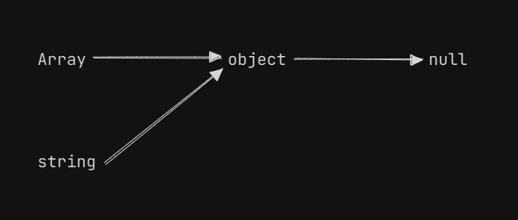
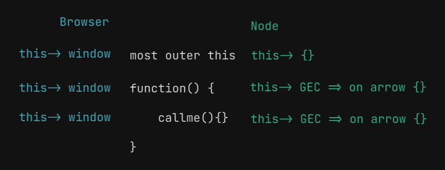

# OOP
js doesn't have classes\
It only has object, prototype and sugar coating to replicate classes 

## 4 Pillar of OOP
- Abstraction
- Encapsulation
- Inheritance
- Polymorphism

## Object
- in javascript everything is an object.
- object is collection of properties and metods.\
[code](object.js)

## why use OOP
to reduce spagiti code\
code is so messed up that no parts can be reused

## parts of OOP
Object literal - {}

- Constructor function
- Prototypes
- Classes
- Instances (new, this)

## importance of 'new' keyword

Here's what happens behind the scenes when the new keyword is used:

- **A new object is created:** The new keyword initiates the creation of a new JavaScript object.

- **A prototype is linked:** The newly created object gets linked to the prototype property of the constructor function. This means that it has access to properties and methods defined on the constructor's prototype.

- **The constructor is called:** The constructor function is called with the specified arguments and this is bound to the newly created object. If no explicit return value is specified from the constructor, JavaScript assumes this, the newly created object, to be the intended return value.

- **The new object is returned:** After the constructor function has been called, if it doesn't return a non-primitive value (object, array, function, etc.), the newly created object is returned.

### code related image
scope of this

[about 'call'](inheritance.js)
about bind\
about apply